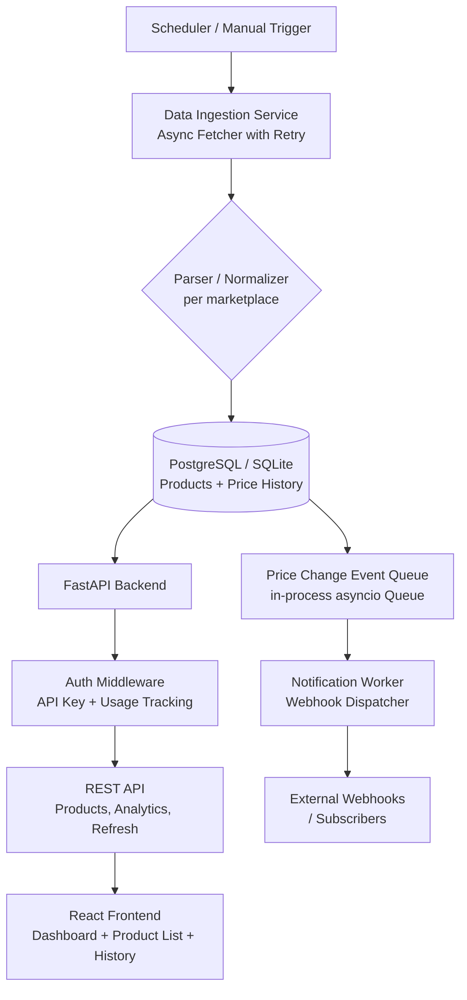
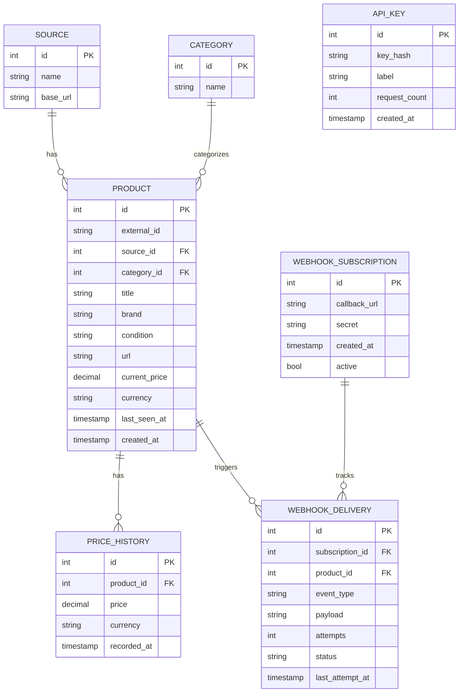

# Entrupy — Product Price Monitoring System: HLD & LLD

---

## High-Level Design (HLD)

### Architecture Overview



### Components

| Component | Role |
|---|---|
| **Data Ingestion Service** | Async fetch + parse data from Grailed, Fashionphile, 1stdibs |
| **Database Layer** | SQLite (dev) / PostgreSQL (prod) via SQLAlchemy async ORM |
| **FastAPI Backend** | REST API, auth, usage tracking, endpoints |
| **Notification Worker** | Detects price changes, dispatches webhooks reliably |
| **React Frontend** | Dashboard, product browser, product detail with price history |

> [!NOTE]
> The system is designed to be single-process friendly (runs as one Python service) but is structured to extract each component into a microservice later.

---

## Low-Level Design (LLD)

### 1. Database Schema



#### Scale Considerations
- `price_history` is partitioned by `recorded_at` (month) in PostgreSQL to handle millions of rows.
- Index on `(product_id, recorded_at DESC)` for fast history queries.
- Index on `(source_id, category_id, current_price)` for filtered product browsing.
- Deduplication: products are matched by `(source_id, external_id)` — `UNIQUE` constraint.

---

### 2. Data Ingestion Service

**File:** `ingestion/fetcher.py`

```
async def fetch_all_sources() -> None
    for each marketplace in [Grailed, FashionPhile, 1stdibs]:
        raw_data = await fetch_with_retry(marketplace.url, retries=3, backoff=2s)
        normalized = marketplace.parser.parse(raw_data)
        await upsert_products(normalized)
        → detect price change → push to event queue
```

- Uses `aiohttp` + `asyncio.gather` for parallel fetching.
- Each marketplace has a dedicated `Parser` class implementing a common `BaseParser` interface.
- Retry uses exponential backoff up to 3 attempts.

---

### 3. API Design (FastAPI)

All routes require an `X-API-Key` header. Usage (count) is recorded per key per request.

| Method | Path | Description |
|---|---|---|
| `POST` | `/api/refresh` | Trigger async data refresh |
| `GET` | `/api/products` | List products — filter by `source`, `category`, `min_price`, `max_price`, `page`, `size` |
| `GET` | `/api/products/{id}` | Product detail + price history |
| `GET` | `/api/analytics` | Totals by source, averages by category, last refresh time |
| `POST` | `/api/webhooks` | Register a webhook subscription |
| `DELETE` | `/api/webhooks/{id}` | Remove subscription |
| `GET` | `/api/health` | Health check |

**Error Handling:**
- Validates all query params with Pydantic; returns `422` on bad input.
- Returns `401` for missing/invalid API keys.
- Returns `429` if usage exceeds configurable rate limit.

---

### 4. Notification System

**Approach: Async In-Process Event Queue + Webhook Dispatcher**

```
Price change detected during upsert
    → push PriceChangeEvent to asyncio.Queue
    → NotificationWorker (background task) consumes queue
        → loads active webhook subscriptions from DB
        → for each subscription: POST payload to callback_url
            → on success: mark WEBHOOK_DELIVERY status=delivered
            → on failure: increment attempts, retry up to 5x with backoff
                → after max retries: status=failed (not lost, stored in DB)
```

**Why this approach over alternatives:**
- **vs. Polling:** Push is lower-latency and cheaper for the client.
- **vs. External Message Queue (Redis/Kafka):** Avoids external dependency; asyncio Queue is sufficient at this scale.
- **Non-blocking:** The fetch process pushes to the queue and moves on. The worker runs as an `asyncio` background task via `asyncio.create_task`.
- **Reliability:** All deliveries are persisted in `webhook_delivery` table — no events are dropped even if the webhook endpoint is down.

---

### 5. Frontend (React + Vite)

**Pages / Components:**

```
App
├── Layout (Navbar, Sidebar)
├── /dashboard         → DashboardPage
│   ├── StatCard (total products, sources, avg price)
│   └── RecentChanges list
├── /products          → ProductListPage  
│   ├── FilterBar (source, category, price range)
│   └── ProductTable (paginated)
└── /products/:id      → ProductDetailPage
    ├── ProductInfo (title, brand, source, condition)
    └── PriceHistoryChart (recharts line chart)
```

**State management:** React Query (TanStack Query) for caching + data fetching.

---

### 6. Project Structure

```
entrupy-price-monitor/
├── backend/
│   ├── main.py                 # FastAPI app entrypoint
│   ├── config.py               # Settings (Pydantic BaseSettings)
│   ├── database.py             # SQLAlchemy async engine + session
│   ├── models/                 # ORM models
│   ├── schemas/                # Pydantic request/response schemas
│   ├── routers/                # API route handlers
│   │   ├── products.py
│   │   ├── analytics.py
│   │   ├── refresh.py
│   │   └── webhooks.py
│   ├── ingestion/
│   │   ├── fetcher.py          # Async fetch + retry
│   │   └── parsers/
│   │       ├── base.py
│   │       ├── grailed.py
│   │       ├── fashionphile.py
│   │       └── firstdibs.py
│   ├── notifications/
│   │   ├── queue.py            # asyncio.Queue wrapper
│   │   └── worker.py           # Webhook dispatcher background task
│   ├── auth/
│   │   └── api_key.py          # Key validation + usage tracking
│   └── tests/
│       ├── test_ingestion.py
│       ├── test_api.py
│       ├── test_notifications.py
│       └── test_analytics.py
├── frontend/
│   ├── src/
│   │   ├── pages/
│   │   ├── components/
│   │   └── api/               # API client (axios)
│   └── package.json
├── data/
│   └── sample/                # Provided marketplace JSON samples
├── requirements.txt            # Pinned versions
├── .gitignore
└── README.md
```

---

### 7. Tech Stack Summary

| Layer | Choice | Reason |
|---|---|---|
| Backend | **FastAPI** | Native async, Pydantic validation, auto-docs |
| ORM | **SQLAlchemy 2.0 (async)** | Non-blocking DB, supports both SQLite & PG |
| HTTP Client | **aiohttp** | Async HTTP, connection pooling |
| Testing | **pytest + pytest-asyncio** | Async test support |
| Frontend | **React + Vite** | Fast dev build, component model |
| Charts | **Recharts** | Lightweight, composable |
| Data Fetching (FE) | **TanStack Query** | Caching + background refresh |
